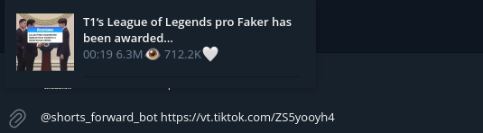

# Inline Бот для отправки роликов 🎬

Inline-бот для Telegram, который позволяет отправлять ролики из **TikTok** и **Instagram** напрямую в личные сообщения **в виде видео**, без открытия встроенного браузера Telegram.

## 🚀 Возможности

* 📥 Приём ссылок на ролики TikTok и Instagram
* 🎥 Автоматическая загрузка и отправка видео файлом
* 💬 Работа через **Inline-режим** (`@botname ссылка`)
* ⚡ Мгновенная отправка видео без переходов в браузер
* 🔒 Отправка видео прямо в личные сообщения

## 🛠 Как это работает

1. Пользователь вводит в любом чате:

   ```
   @botname <ссылка на ролик>
   ```
2. Бот обрабатывает ссылку
3. Видео загружается с источника
4. Ролик отправляется в чат как обычное видео

## 📦 Поддерживаемые платформы

* ✅ TikTok
* ✅ Instagram Reels


## ⚙️ Установка и запуск

```bash
# Клонирование репозитория
git clone https://github.com/StounhandJ/shorts_forward
cd shorts_forward

# Замена токена бота
cp .env.example .env
nano .env

# Запуск бота
make up
```

## 🔐 Переменные окружения

Создайте файл `.env` и укажите:

```env
APP_TG_BOT_TOKEN=your_telegram_bot_token
```

## 📌 Пример использования

В любом чате Telegram:

Использовать @botname   


Выбор из указанных вариантов   


После выбора в чат отправится видео   


